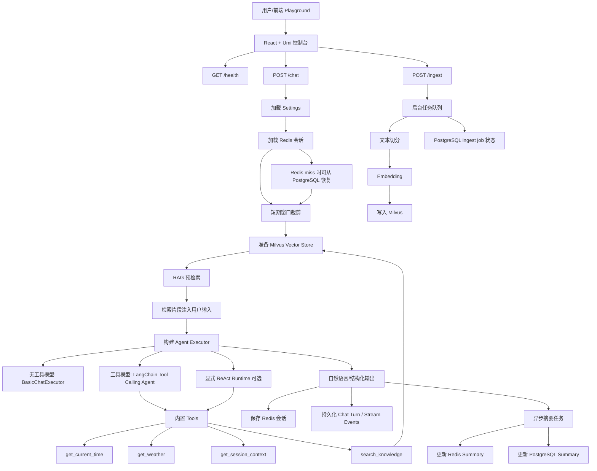

# SlothBearFlow Agent 能力全景梳理

更新时间：2026-06-29

## 1. 结论概览

SlothBearFlow 当前已经具备一个可本地运行的企业级 Agent 服务雏形：后端以 FastAPI 承载 `/chat`、`/ingest`、`/health` 三类核心接口，Agent 层基于 LangChain 接入 Ollama/OpenAI 两类模型，工具调用、RAG 预检索、Redis 会话记忆、PostgreSQL 元数据持久化、Milvus 向量存储、流式 SSE 输出和前端 Playground 已经形成闭环。

从代码实现看，项目当前更接近“单 Agent + 工具 + RAG + 记忆 + 本地控制台”的形态。多 Agent 编排、MCP 接入、自动评估体系、权限隔离型工具沙箱仍属于待扩展能力，不应在对外介绍中表述为已完成。

| 能力域 | 当前状态 | 主要证据 |
| --- | --- | --- |
| Agent 核心 | 已实现 | `backend/src/slothbearflow_backend/agent/agent_executor.py` |
| Tool Call / Function Call | 已实现基础能力 | `tools/registry.py`、`time_tool.py`、`weather_tool.py`、`session_tool.py`、`rag_tool.py` |
| RAG | 已实现可用链路 | `rag/embedding.py`、`rag/milvus_store.py`、`rag/ingest.py`、`tools/rag_tool.py` |
| 记忆系统 | 已实现 Redis + PostgreSQL + 摘要 | `memory/redis_memory.py`、`memory/summary_memory.py`、`persistence/postgres.py` |
| MCP | 未在仓库实现 | 代码中未发现 MCP server/client、协议适配或 MCP 工具注册 |
| 多 Agent | 暂未实现 | 当前为单 Agent Executor/Runtime |
| 评估与测试 | 部分实现 | `backend/tests/test_smoke.py` 覆盖 smoke、RAG、流式、持久化等 |
| 可观测性 | 部分实现 | `/health`、Rotating logs、PostgreSQL stream events、前端 Run events |
| 工程化安全与护栏 | 部分实现 | 配置开关、降级策略、CORS、本地依赖编排、队列限流、Agent 迭代上限 |

## 2. 项目运行链路

### 2.1 后端入口

后端入口位于 `backend/src/slothbearflow_backend/main.py`，应用启动时会：

- 配置日志文件输出，包括 app、access、error 三类日志；
- 创建 FastAPI 应用，并启用 lifespan；
- 在 lifespan 中初始化 PostgreSQL schema；
- 创建后台 `asyncio.Queue`；
- 启动 `worker_loop` 处理 ingest 与 summary 异步任务；
- 开放 CORS 给本地前端 `127.0.0.1:5173` / `localhost:5173`。

核心接口：

| 接口 | 作用 | 说明 |
| --- | --- | --- |
| `GET /` | 服务入口信息 | 返回 docs、health、chat、ingest 路径 |
| `GET /health` | 健康检查 | 聚合 Redis、Milvus、PostgreSQL、LLM、Embedding 状态 |
| `POST /chat` | Agent 对话 | 支持非流式 JSON 与 SSE/纯文本流式输出 |
| `POST /ingest` | 知识入库 | 将文本任务放入后台队列，写入 Milvus |

### 2.2 前端控制台

前端位于 `frontend/`，使用 React + Umi + TypeScript。核心页面是 `frontend/src/pages/index.tsx`，直接请求本地后端 `http://127.0.0.1:8000`。

已实现能力：

- 每 30 秒刷新 `/health`；
- 展示 LLM、Redis、Milvus、PostgreSQL 状态；
- 管理 session id；
- 调用 `/chat`，支持 JSON 与 SSE 流式响应；
- 展示 citations；
- 调用 `/ingest` 上传知识文本；
- 维护前端侧 Run events 面板。

前端是一个本地 Agent Playground，不是纯展示页，已经能作为联调和演示入口使用。

## 3. Agent 核心逻辑

### 3.1 执行器选择

Agent 入口是 `build_agent_executor()`，位于 `backend/src/slothbearflow_backend/agent/agent_executor.py`。

当前有三条执行路径：

1. **模型不支持工具调用**

   当 `llm_supports_tools(settings)` 为 false 时，构建 `BasicChatExecutor`：

   - Prompt = System + History + Input；
   - 不注册 LangChain tools；
   - 支持普通 invoke 与 stream；
   - 依赖 `/chat` 入口提前把 RAG 检索片段注入用户输入。

2. **模型支持工具调用，默认路径**

   默认使用 LangChain 的 `create_tool_calling_agent()`：

   - Prompt = System + History + Human Input + Agent Scratchpad；
   - 工具来自 `build_tools()`；
   - 包装为 `AgentExecutor`；
   - 设置 `handle_parsing_errors=True`；
   - 设置 `max_iterations=4`；
   - 设置 `early_stopping_method="generate"`。

3. **显式 ReAct Runtime**

   当 `ENABLE_EXPLICIT_REACT_RUNTIME=true` 时，启用 `ExplicitReActRuntime`：

   - 手动执行 Reason/Act/Observe 循环；
   - 每轮调用 `llm.bind_tools(tools)`；
   - 解析 `AIMessage.tool_calls`；
   - 调用工具后把 observation 写回 `ToolMessage`；
   - 通过 `REACT_MAX_STEPS` 限制最大步数；
   - 返回 `stop_reason`、`steps`、`tools_used` 等元信息。

### 3.2 Prompt 设计

Prompt 位于 `backend/src/slothbearflow_backend/prompt.py`。

系统提示词包含：

- 工具优先规则；
- RAG 使用规范；
- 会话上下文工具使用规则；
- 时间/天气工具使用规则；
- 不确定时诚实说明；
- 结构化输出开关；
- 历史摘要注入。

如果模型不支持工具，Prompt 会切换为“禁止假装调用工具或访问外部系统”的 no-tool 规则，这是当前项目比较重要的护栏之一。

### 3.3 `/chat` 主流程

`POST /chat` 的处理逻辑集中在 `main.py`：

1. 读取 settings；
2. 重置 RAG context；
3. 加载 session payload；
4. 将 Redis payload 转为 LangChain messages；
5. 按 `MEMORY_WINDOW_PAIRS` 裁剪短期上下文；
6. 初始化或获取 Milvus vector store；
7. 若 vector store 可用，先执行 RAG 预检索；
8. 将 RAG 片段注入用户输入；
9. 构建 Agent executor；
10. 根据配置决定流式或非流式输出；
11. 执行 Agent；
12. 合并 RAG citations；
13. 持久化会话、chat turn、stream events；
14. 异步入队 summary 更新任务。

这里最关键的设计是第 7-8 步：即使本地 Ollama 模型不支持 tool call，也能通过“预检索 + 输入增强”的方式使用 RAG 依据回答。

## 4. Tool Call / Function Call

### 4.1 工具注册

工具注册入口是 `backend/src/slothbearflow_backend/tools/registry.py`。

默认工具包括：

| 工具 | 文件 | 能力 |
| --- | --- | --- |
| `get_current_time` | `tools/time_tool.py` | 返回当前本地时间 |
| `get_weather` | `tools/weather_tool.py` | 返回离线样例天气 |
| `get_session_context` | `tools/session_tool.py` | 返回最近会话上下文 |
| `search_knowledge` | `tools/rag_tool.py` | 检索知识库，RAG 开启且 Milvus 可用时注册 |

工具均使用 LangChain `@tool` 装饰器暴露给 tool-calling agent。

### 4.2 Function Call 能力边界

当前项目实现的是 LangChain tool/function calling 抽象，而不是某一个厂商 SDK 的原生 function call 手写协议。

模型能力由 `backend/src/slothbearflow_backend/llm.py` 判断：

- `LLM_PROVIDER=openai` 默认支持工具；
- `LLM_PROVIDER=ollama` 默认不支持工具；
- 可通过 `LLM_SUPPORTS_TOOLS`、`OPENAI_MODEL_SUPPORTS_TOOLS`、`OLLAMA_MODEL_SUPPORTS_TOOLS` 覆盖。

因此当前 function call 能力与所选模型强相关：

- OpenAI 或 OpenAI-compatible 模型：默认走 tool-calling agent；
- Ollama 本地模型：默认走 BasicChatExecutor；
- 如果用户确认某个 Ollama 模型支持 tool calling，可以通过配置开启。

### 4.3 工具调用结果收集

RAG 工具会通过 contextvars 记录最近一次 RAG sources/citations：

- `get_last_rag_sources()`
- `get_last_rag_citations()`
- `reset_rag_sources()`

同时 `/chat` 入口还会做预检索 citations 合并，所以当前 API 响应里的 citations 主要来自：

- RAG prefetch；
- `search_knowledge` 工具调用记录；
- 二者去重后的合并结果。

## 5. RAG 实现

### 5.1 Embedding 层

Embedding 入口是 `backend/src/slothbearflow_backend/rag/embedding.py`。

支持两类 provider：

- Ollama：默认 `nomic-embed-text`；
- OpenAI：默认 `text-embedding-3-small`。

`EMBEDDING_PROVIDER` 为空时会跟随 `LLM_PROVIDER`。

### 5.2 向量存储

Milvus 实现在 `backend/src/slothbearflow_backend/rag/milvus_store.py`。

当前没有直接使用 LangChain Milvus VectorStore，而是封装了 `SimpleMilvusVectorStore`：

- 使用 `pymilvus.MilvusClient`；
- 自动创建 collection；
- schema 包含 `id`、`text`、`source`、`metadata`、`vector`；
- vector 字段使用 `FLOAT_VECTOR`；
- index 使用 `AUTOINDEX`；
- 相似度检索使用 `COSINE`；
- `add_documents()` 负责 embedding + insert + flush；
- `similarity_search()` 负责向量召回。

`get_vector_store()` 带有进程内缓存，Milvus 初始化失败时会记录 `_vector_store_error` 并降级返回 `None`，避免每轮请求反复阻塞初始化。

### 5.3 混合召回

项目已实现一个轻量 BM25 关键词召回：

- `_tokenize_for_bm25()` 同时处理英文 token、中文字符、中文 bigram；
- `_bm25_rank()` 对候选文档打分；
- `SimpleMilvusVectorStore.keyword_search()` 从 Milvus query 候选，再做本地 BM25 排序。

`retrieve_knowledge_context()` 会合并：

- `keyword_search()` 的关键词命中；
- `similarity_search()` 的向量命中。

随后执行：

- 去重；
- 对特定项目文档加权；
- 取前 `max_context` 个片段；
- 生成 `【检索片段】` 上下文；
- 返回 sources 和 citations。

### 5.4 Ingest 链路

`POST /ingest` 接收文本后不直接写 Milvus，而是：

1. 生成 `job_id`；
2. 投递到 FastAPI lifespan 创建的后台队列；
3. PostgreSQL 记录 ingest job 为 `queued`；
4. `worker_loop()` 消费任务；
5. `ingest_plain_text()` 调用 `split_text_to_documents()`；
6. 文档被切分为 chunk；
7. 写入 Milvus；
8. PostgreSQL 更新任务状态为 `completed`、`skipped` 或 `failed`。

切分策略位于 `rag/splitter.py`：

- `chunk_size=500`
- `chunk_overlap=100`
- 使用 LangChain `RecursiveCharacterTextSplitter`

### 5.5 RAG 当前边界

已实现：

- 向量召回；
- BM25 关键词召回；
- 简单重排/加权；
- 来源 citations；
- 无工具模型的 RAG 预注入；
- ingest 异步任务；
- Milvus 不可用时降级。

未实现或仍可增强：

- 真正的 reranker 模型；
- 查询改写；
- 文档级权限过滤；
- 多 collection/多租户；
- 文件上传解析；
- ingest 任务查询接口；
- citation score 回传；
- RAG 质量评估集。

## 6. 记忆系统

### 6.1 短期记忆

短期记忆由 `memory/short_memory.py` 实现：

- 输入 LangChain messages；
- 按 `MEMORY_WINDOW_PAIRS` 保留最近 N 轮；
- 默认 `.env.example` 中是 6 轮。

该短期窗口会作为 `chat_history` 注入 Prompt。

### 6.2 Redis 会话缓存

Redis 会话逻辑在 `memory/redis_memory.py`：

- key 前缀：`chat:session:`;
- payload 结构：`{"messages": [], "summary": ""}`;
- 每轮对话追加 user/assistant 两条消息；
- 默认 TTL 7 天；
- Redis 不可用时通过 `InMemoryRedis` 降级。

Redis 降级是本地体验友好的设计，但生产环境要关注：内存降级不具备跨进程共享和持久性。

### 6.3 PostgreSQL 持久化

PostgreSQL 逻辑位于 `persistence/postgres.py`。

已创建/维护的表：

| 表 | 作用 |
| --- | --- |
| `agent_sessions` | session 摘要与最后一轮消息 |
| `agent_chat_turns` | 每轮 user/assistant、raw output、source、tools、citations |
| `agent_chat_stream_events` | 流式事件序列 |
| `agent_ingest_jobs` | 知识入库任务状态 |

当 Redis miss 且 `POSTGRES_RESTORE_ON_REDIS_MISS=true` 时，会从 PostgreSQL 读取最近若干轮对话和 summary，恢复到 Redis。

### 6.4 摘要记忆

摘要逻辑位于 `memory/summary_memory.py`。

流程：

1. 每轮 `/chat` 后，如果 `ASYNC_SUMMARY_UPDATE=true`，投递 `summarize` 任务；
2. 后台 worker 调用 `run_summary_job()`；
3. 读取最近 20 条消息；
4. 调用 LLM 压缩成不超过 120 字中文摘要；
5. 更新 Redis payload；
6. 持久化到 PostgreSQL `agent_sessions.summary`。

摘要会在后续 Prompt 的 `rolling_summary` 中注入，用于长期上下文延续。

## 7. MCP 现状

当前仓库没有实现 MCP 能力。

我在 `backend/`、`frontend/`、`docs/`、`README.md` 中检索了 `MCP`、`mcp`、`Model Context Protocol` 等关键字，没有发现：

- MCP server；
- MCP client；
- MCP tool adapter；
- MCP manifest/config；
- MCP transport；
- 将 MCP 工具映射到 LangChain Tool 的注册层。

因此文档中建议将 MCP 标注为“规划中/待扩展”，不要写成项目已完成能力。

未来如果要接入 MCP，比较自然的落点是：

- 新增 `backend/src/slothbearflow_backend/mcp/`；
- 在 `tools/registry.py` 中合并本地工具与 MCP 工具；
- 增加 MCP 工具白名单、超时、错误隔离；
- 将 MCP tool call 事件写入 PostgreSQL；
- 在前端 Run events 中展示 MCP 调用状态。

## 8. 多 Agent 现状

当前项目暂未实现多 Agent。

已有实现是单 Agent executor：

- BasicChatExecutor；
- LangChain tool-calling AgentExecutor；
- ExplicitReActRuntime。

它们都是单个 Agent 对单次用户输入进行处理，并没有：

- planner/executor/reviewer 拆分；
- 多角色 agent 协同；
- agent graph；
- supervisor/router；
- 任务 DAG；
- agent 间消息协议。

多 Agent 可以后续基于当前模块扩展，但目前建议先把单 Agent 的工具抽象、RAG 评估、可观测 trace 做扎实。

## 9. 评估与测试

### 9.1 自动化测试现状

测试集中在 `backend/tests/test_smoke.py`。

已覆盖：

- `/health`；
- `/`；
- 配置加载；
- 无工具模型 fallback；
- 显式 ReAct runtime；
- ReAct max steps；
- Ollama/OpenAI LLM 参数组装；
- embedding provider；
- 默认输出配置；
- SSE 流式输出；
- plain text 流式输出；
- 内存会话存储；
- PostgreSQL chat turn 持久化；
- ingest 开关与任务；
- stream events 持久化；
- Redis miss 从 PostgreSQL 恢复；
- RAG citations；
- 无工具模型的 RAG prefetch；
- BM25 排序；
- keyword + vector 混合召回。

我在本次梳理前曾运行：

```bash
./.venv/bin/python -m pytest -q backend/tests
```

结果为：

```text
28 passed
```

### 9.2 当前缺少的评估能力

目前测试更偏工程 smoke 和单元行为验证，还不是完整 Agent 评估体系。

建议补齐：

- RAG golden dataset；
- answer faithfulness 评估；
- citation precision/recall；
- tool call 选择准确率；
- 多轮记忆恢复测试集；
- 流式输出完整性测试；
- latency 基准；
- 失败降级场景矩阵；
- prompt regression tests。

## 10. 可观测性

### 10.1 服务健康观测

`GET /health` 已经聚合：

- Redis ping；
- session store backend；
- Milvus collection 状态；
- PostgreSQL ready 状态；
- LLM provider/model；
- Embedding provider/model；
- Ollama base URL。

前端会周期性调用 `/health` 并在 Service health 面板展示状态。

### 10.2 日志

`main.py` 中 `_configure_logging()` 使用 `RotatingFileHandler`：

- app log；
- access log；
- error log；
- 单文件 5MB；
- 保留 5 个备份。

`/chat` 内部记录多个阶段耗时：

- settings load；
- rag context reset；
- session load；
- history prepare；
- vector store prepare；
- rag prefetch；
- executor build；
- agent invoke；
- result parse；
- session save；
- summary enqueue。

这已经能支撑本地排障和基本性能定位。

### 10.3 流式事件持久化

当 PostgreSQL 启用时，流式输出会持久化：

- start event；
- chunk events；
- done event。

表是 `agent_chat_stream_events`，这为后续回放和调试流式输出提供基础。

### 10.4 前端 Run Events

前端 `TraceEvent` 是 UI 侧事件，不是后端真实 OpenTelemetry trace。当前能展示：

- health ready/degraded；
- chat request；
- chat completed；
- ingest queued/accepted；
- error/warn。

它适合本地操作反馈，但还不是生产级 tracing。

### 10.5 LangSmith

`.env.example` 中保留了 LangSmith 配置：

- `LANGCHAIN_TRACING_V2`
- `LANGCHAIN_API_KEY`
- `LANGCHAIN_PROJECT`

但当前代码没有显式封装 LangSmith trace，也没有在文档或测试中验证链路。它更多是 LangChain 生态的环境开关预留。

## 11. 工程化安全与护栏

### 11.1 配置与密钥

配置由 `pydantic-settings` 管理，`Settings` 会按顺序加载：

```text
.env
backend/.env
.env.local
backend/.env.local
.env.private
backend/.env.private
```

`.gitignore` 已包含 `.env`、`backend/.env`、私有 env、日志、虚拟环境、node_modules、dist 等规则。

注意：`.env` 应作为本地私有文件，不应提交。仓库应只保留 `backend/.env.example` 作为模板。

### 11.2 输入校验

FastAPI/Pydantic 对请求有基础校验：

- `ChatRequest.session_id` 最小 1、最大 128；
- `ChatRequest.message` 最小 1；
- `IngestRequest.text` 最小 1；
- `IngestRequest.source` 最大 256。

这能挡住部分空输入和超长 source，但还没有完整的 prompt injection、防滥用、内容安全策略。

### 11.3 工具护栏

已有护栏：

- 模型不支持工具时，Prompt 明确禁止假装调用工具；
- AgentExecutor 限制 `max_iterations=4`；
- 显式 ReAct runtime 限制 `REACT_MAX_STEPS`；
- RAG 关闭或 Milvus 不可用时不注册 `search_knowledge`；
- `/ingest` 在 `SKIP_MILVUS` 或 `USE_RAG=false` 时直接拒绝；
- Redis/Milvus/PostgreSQL 失败会降级或跳过，不阻断基础聊天；
- 后台队列有 `JOB_QUEUE_MAX`，满时返回 503。

当前不足：

- `REACT_TOOL_TIMEOUT_SEC` 已有配置，但显式 ReAct `_invoke_tool()` 尚未真正应用超时；
- 工具没有权限分级；
- 没有外部工具沙箱；
- 没有工具调用审计明细表；
- 没有敏感信息脱敏；
- 没有用户级 quota/rate limit；
- 没有 RAG 文档权限过滤；
- 没有对 prompt injection 的专门检测。

### 11.4 CORS 与本地开发边界

后端 CORS 只放行本地前端：

```text
http://127.0.0.1:5173
http://localhost:5173
```

这适合本地开发。若部署到服务器，需要改为明确的生产域名，并补充认证鉴权。

### 11.5 依赖编排

`backend/docker-compose.yml` 已提供本地依赖：

- Redis；
- PostgreSQL；
- etcd；
- MinIO；
- Milvus standalone。

这使项目可在本地复现完整 RAG/记忆/持久化链路。

## 12. 已实现能力调用链总图



## 13. 后续优化建议

### 13.1 优先级 P0

- 将 `.env`、`logs/*.log` 从 Git 跟踪中永久移除，只保留模板；
- 为生产部署补充认证、鉴权、rate limit；
- 为 tool call 增加真实超时控制；
- 为 RAG 增加 ingest job 查询接口；
- 明确 Ollama 工具调用支持矩阵，避免配置误开。

### 13.2 优先级 P1

- 抽象统一 Tool Registry，支持配置化启停；
- 增加 MCP adapter，把 MCP tools 转为 LangChain tools；
- 增加 RAG 评估集与 citation 准确率测试；
- 增加 prompt regression tests；
- 增加 OpenTelemetry 或 LangSmith 显式 trace；
- 将前端 API base 从硬编码改为环境配置。

### 13.3 优先级 P2

- 引入 reranker；
- 增加文档上传解析；
- 支持多 collection；
- 支持多用户/多租户 session；
- 将多 Agent 编排作为独立模块试验；
- 增加管理端查看 chat turns、stream events、ingest jobs。

## 14. 当前可对外表述版本

更准确的表述是：

> SlothBearFlow 是一个本地优先的 AI Agent 服务脚手架，已实现 FastAPI 后端、React/Umi 本地控制台、Ollama/OpenAI 模型适配、LangChain 工具调用、RAG 检索增强、Redis 会话记忆、PostgreSQL 元数据持久化、Milvus 向量存储、SSE 流式输出和基础可观测能力。当前 MCP、多 Agent 编排、生产级安全治理和系统化评估仍处于待扩展阶段。
